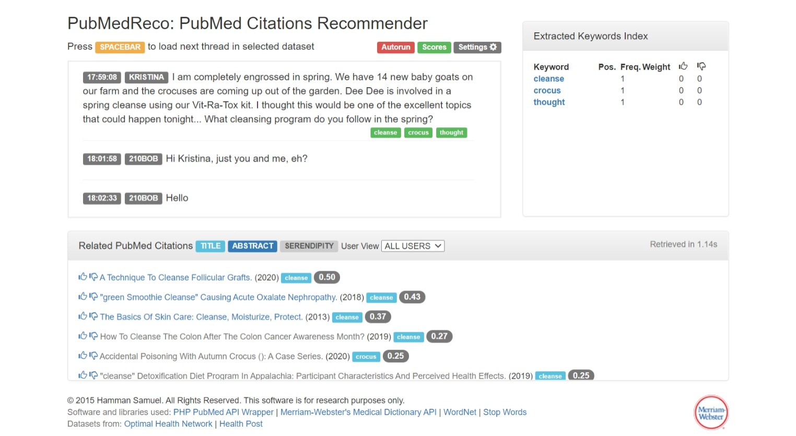

# PubMedReco
Real-time chat web app that recommends PubMed citations relevant to the conversation thread. This code is for research purposes, please cite the following publication (DOI: [10.3233/978-1-61499-830-3-207](https://dx.doi.org/10.3233/978-1-61499-830-3-207 )) when modifying or using this source code.

```
@inproceedings{SamuelZaiane2017,
  title = {{PubMedReco: A PubMed Citations Recommender System for Real-Time Chat}},
  author = {Samuel, Hamman and Zaiane, Osmar},
  booktitle = {16th World Congress on Medical and Health Informatics (MedInfo)},
  year = {2017},
  organization = {IMIA}
}
```

# Demo

A working [live web app](http://199.116.235.207:82/pubmedreco/) is available for demo purposes.




# Dependencies
This code uses the following free or open source libraries.

- [PHP PubMed API Wrapper](https://github.com/asifr/PHP-PubMed-API-Wrapper)
- [Merriam-Webster's Medical Dictionary API](https://www.dictionaryapi.com/)
- [WordNet](https://wordnet.princeton.edu/)

# Setup
The code is tested with PHP Version 7.2.6. For local use, [XAMPP](https://www.apachefriends.org) is recommended for quick set up. To set up the database, create it in phpMyAdmin as `dictionary_db` and then import the `dictionary_db.sql` file to create the necessary tables. To change database connection configurations, edit `connect.php`.